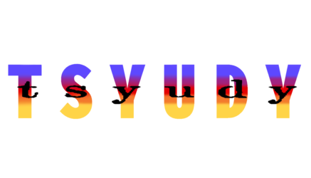

  

Hecho con **Godot Engine 4.6**.

---

### Sistema de Combate 3D "M.U.K.K.E.N."
* Sistema de pelea de arquetipo 2.5D, similar a **KOF: Maximum Impact**
* Frame data directa manejada por personaje, con distintos estados (stagger, hitstun, blockstun, etc.)

### Prueba de sistema de NPC's
* Los NPCs se dividen en facciones. Los **TT (Terroristas)** irán directo a plantar la bomba en los sitios A o B, y los **CT (Counter-Terrorists)** correrán para desactivarla.
* NPCs que caminan, corren, hacen bhop si van con prisa, y escriben y hablan en chat con nombres propios.

---

## Controles

Los controles del sistema se pueden remapear desde el menu principal. La pantalla de controles integrada lee y escribe directamente las entradas del jugador para remapear los controles de combate y de exploración.

---

## Compilación

1. Clona o descarga el repositorio.
2. Abre el proyecto en **Godot 4.6+** (Net / Mono o estándar).
3. El programa inicia por default en menu.tscn